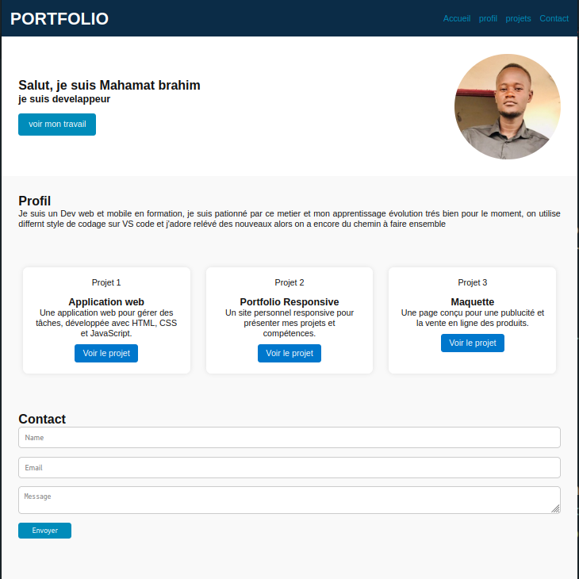

# PORTFOLIO
Développeur web passionné, je conçois des interfaces modernes, performantes et responsive.
Mes projets reflètent mon souci du détail, ma maîtrise des technologies front-end (HTML, CSS, JavaScript…) et mon engagement à livrer un travail bien ordonné, clair et efficace.
Toujours curieux, j’aime apprendre, innover et relever de nouveaux défis techniques.
# Technologies utilisé 
    HTML CSS JS et GITHUB(Page Hebergement gratuite)
# capture d'écran
 voici un apperçu de l'interface de notre PORTFOLIO:
